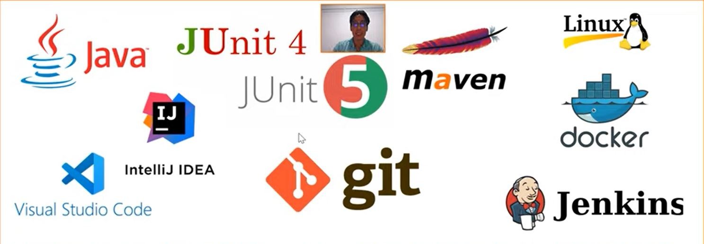

# Overview Java dev

Dans cette formation, je vais essayer de revoir les bases fondamentales du développement en java à  partir de zéro avec le Professeur Mohamed Youssfi.
## Déroulement de la formation 
* au depart je vais essayer avec lui de travailler sur ligne de commande pour éviter les IDE pour un début.
* je vais essayer de comprendre
  1. le compilateur java 
  2. le JDK
  3. la machine virtuelle java
* je vais comprendre comment 
   1. compiler les applications 
   2.  générer un jar
* Comprendre
   1.  c'est quoi un jar
   2.  faire les test unitaire avec **JUnit 4**
   3.  c'est quoi **Maven**
   4.  pourquoi il faut l'utiliser
   5.  pour quoi c'est important de connaître **git**
   6.  c'est quoi le versionning
   7.  quel est l'apport des IDE dans le cycle de dévéloppement
* Les outils DevOps
   1. linux
   2. docker
   3. jenkins