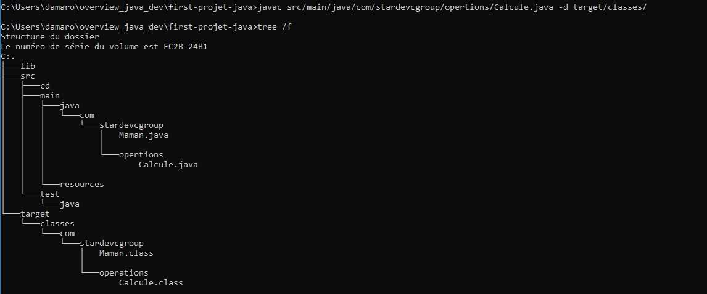
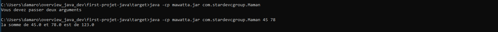

# Overview Java dev

Dans cette formation, je vais essayer de revoir les bases fondamentales du développement en java à  partir de zéro avec le Professeur Mohamed Youssfi.
## Déroulement de la formation 
* au depart je vais essayer avec lui de travailler sur ligne de commande pour éviter les IDE pour un début.
* je vais essayer de comprendre
  1. le compilateur java 
  2. le JDK
  3. la machine virtuelle java
* je vais comprendre comment 
   1. compiler les applications 
   2.  générer un jar
* Comprendre
   1.  c'est quoi un jar
   2.  faire les test unitaire avec **JUnit 4**
   3.  c'est quoi **Maven**
   4.  pourquoi il faut l'utiliser
   5.  pour quoi c'est important de connaître **git**
   6.  c'est quoi le versionning
   7.  quel est l'apport des IDE dans le cycle de dévéloppement
* Les outils DevOps
   1. linux
   2. docker
   3. jenkins

## Qu'est ce qu'il faut pour dévélopper les application java dans sa machine
Pour pouvoir faire du dévéloppement java, il faut absolument avoir le kit de dévéloppement java ou Java development Kit (JDK), pour cela il est conseiller d'avoir JDK 8 car il est jugé stable pour ces raisons la plupart des entreprises l'adoptent et il est également compatible avec  les versions supérieures.
[ici vous pouvez le JDK 8](https://www.oracle.com/java/technologies/javase/javase-jdk8-downloads.html)
et Java Runtime Environment(JRE)
## Le Java Development Kit (JDK)
désigne un ensemble de bibliothèques logicielles de base du langage de programmation Java, ainsi que les outils avec lesquels le code Java peut être compilé, transformé en bytecode destiné à la machine virtuelle Java. [Source Wikipédia](https://fr.wikipedia.org/wiki/Java_Development_Kit)
## Java Runtime Environment
**Java Runtime Environment (JRE)**
est une couche logicielle qui s'exécute sur le logiciel du système d'exploitation d'un ordinateur et fournit les bibliothèques de classes et d'autres ressources dont un programme Java spécifique a besoin pour s'exécuter.[Source IBM](https://www.ibm.com/cloud/learn/jre)

## java Virtual Machine (JVM)
La machine virtuelle Java ou JVM (Java Virtual Machine) est un environnement d'exécution pour applications Java.

C'est un des éléments les plus importants de la plate-forme Java. Elle assure l'indépendance du matériel et du système d'exploitation lors de l'exécution des applications Java. Une application Java ne s'exécute pas directement dans le système d'exploitation mais dans une machine virtuelle qui s'exécute dans le système d'exploitation et propose une couche d'abstraction entre l'application Java et ce système. [Source Jean-Michel DOUDOUX](https://www.jmdoudoux.fr/java/dej/chap-jvm.htm)
La machine virtuelle permet notamment :
* l'interprétation du bytecode
* l'interaction avec le système d'exploitation
* la gestion de sa mémoire grâce au ramasse-miettes
## JDK vs JRE vs JVM

## Variables d'environnement Java
Tout d'abord l'avantage des variables d'environnement est de nous permettre d'exécuter les application en ligne de commande
* **JAVA_HOME**
  
* **path** pour toutes les variables d'environnement
  

  ## Quelques commande
  * javac pour dire java compiler
  * java pour l'execution de java
  
  ## Création manuelle de la structure d'un projet java
  pour voir l'arborescence du projet <code>tree</code>
  

## Création du package sans IDE

* on va dans java puis on crée un premier dossier qui correspond au top level de notre nom de domaine et doit être tout en miniscule, dans notre cas c'est **com** 
  <code>mkdir src/main/java/com</code>
puis un autre sous dossier dans **com** qui fait réference au nom du domaine **stardevcgroup**
<code>mkdir src/main/java/com/stardevcgroup</code>

## Création du fichier java
Avant de nous lancer dans le code, il faut tout d'abord noter que notre classe doit commencer par une majuscule, le fichier java doit java doit avoir le même nom que la classe et pas d'accent encore ni caractères spéciaux.
<code> touch src/main/java/com/stardevcgroup/Maman.java</code>

## Création de la classe Java
prémière chose à faire dans fichier java est d'indiquer le package 
<code>package com.stardevcgroup;</code>

## Compilation de la classe java
Pour compiler notre classe, on se rend dans le dossier où elle se situe puis nous spécifions là où nous voulons que la compilation place la sortie avec la commande suivante

<code>javac src/main/java/com/stardevcgroup/Maman.java -d target/classes/</code>

## Exécution
Pour lancer une application java, on utilise la commande **java** suivi de l'option **-cp** pour dire **classpath** 
<code>java -cp target/classes/ com.stardevcgroup.Maman</code>

## Création d'un autre package

## Création de la classe Calcule

## Compilation de la classe Calcule

## Compilation de la classe Maman

## Exécution de la classe  Maman avec les variables

## Exécution de la classe  Maman avec les arguments

## Test partie 1
<code>javac -d .\target\classes -cp ".\lib\junit-4.13.jar;harcrest-core-1.3.jar;.\target\classes"  src\test\java\com\stardevcgroup\opertions\CalculeTest.java</code>

## Exécution du test unitire
<code>java -cp ".;.\lib\junit-4.13.jar;.\lib\hamcrest-core-1.3.jar;.\target\classes" org.junit.runner.JUnitCore com.stardevcgroup.opertions.CalculeTest</code>

## Création du jar non exécutable avec la ligne de commande
Pour cela, on rend dans le dossier où se trouve les fichiers d'extension **.class** puis  
<code> jar cfv nomDuFichier.jar LesIncludesDansLeJar</code>
exemple: 
<code>cd target/classes</code> en suite 
<code>jar cfv ../mawatta.jar .</code>

## Exécution du jar non exécutable
<code>java -cp mawatta.jar com.stardevcgroup.Maman 45 78</code>

## Création d'un jar exécutable
nous allons créer un fichier dans le dossier **resources** de préference et on va nommer le fichier **MANIFEST.txt** et à la première ligne de ce fichier nous allons ajouter cette instruction:
* Main-Class: package de la classe main suivi du nom de la class Main
  Exemple:  
  <code>Main-Class: com.stardevcgroup.Maman</code>
* puis on génère la classe principale avec cette commande 
  <code>jar cfvm ../mawatta.jar ../../src/main/resources/MANIFEST.txt . ../../lib/</code>

## Exécution du jar exécutable 
<code>cd ..</code> 
<code>java -jar mawatta.jar</code> 
<code>java -jar mawatta.jar 25 36</code> 
